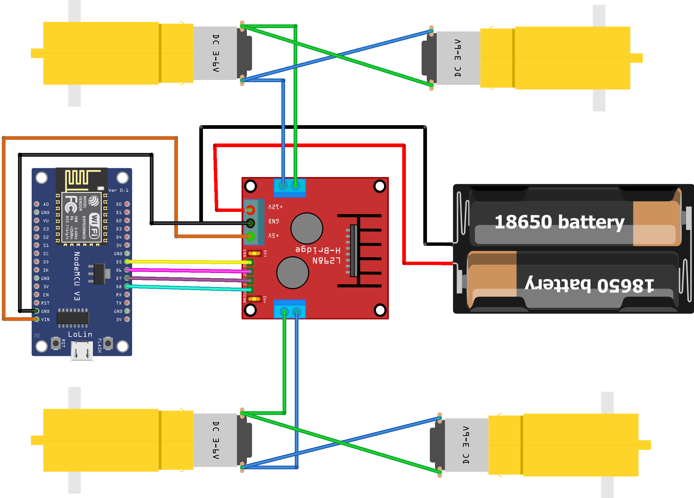
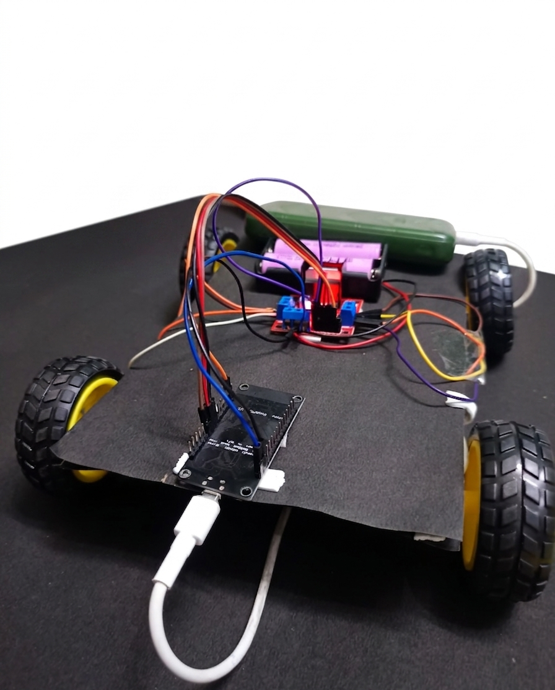

# Mobile App Controlled Robot Car using ESP8266

## Overview
This project is a Mobile App Controlled Robot Car developed using ESP8266 NodeMCU and L298N Motor Driver. The robot can be controlled wirelessly through a mobile application over WiFi, allowing real-time movement in different directions.

The project demonstrates the fundamentals of IoT, wireless communication, motor interfacing, and embedded systems.

---

## Features
- Wireless control using mobile application
- Real-time robot movement
- WiFi-based communication
- Smooth directional control
- Beginner-friendly IoT and robotics project

---

## Components Used
- ESP8266 NodeMCU
- L298N Motor Driver
- BO Motors
- Robot Chassis
- Wheels
- Jumper Wires
- Battery Pack

---

## Working Principle
The ESP8266 NodeMCU connects to a mobile application through WiFi communication. Commands sent from the mobile app are processed by the ESP8266 and forwarded to the L298N motor driver.

The motor driver controls the motors accordingly, enabling the robot to move forward, backward, left, and right in real time.

---

## Pin Configuration

| Component | ESP8266 Pin |
|-----------|-------------|
| IN1 | D5 |
| IN2 | D6 |
| IN3 | D7 |
| IN4 | D1 |
---

## Applications
- Wireless robotics
- Smart vehicle systems
- IoT-based automation
- Educational robotics projects
- Remote-controlled systems

---

## Technologies Used
- Arduino IDE
- ESP8266 WiFi Module
- Embedded C/C++
- IoT Fundamentals

---

## Future Improvements
- Obstacle avoidance system
- Camera integration
- Voice control
- GPS tracking
- Live monitoring system

---

## Circuit Diagram

## Robot Photo

## Demo Video

Watch the live working demo of the ESP8266 WiFi Controlled Robot:

https://github.com/user-attachments/assets/b69b3a55-76c8-405f-bb28-a98f4d6a661a

## Author
Sauhard Agnihotri
